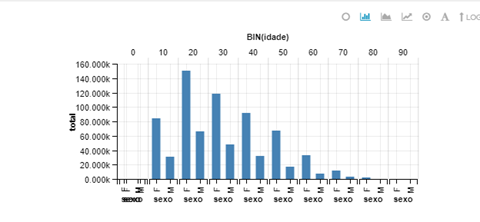

## Trabalho Prático 1 - HIV/BIG.OF2

#### Rômulo Madureira Rodrigues

### Questão 1
*Faça a importação do arquivo credito_conc.csv e crie uma tabela utilizando o HCatalog
chamada: credit_data*

- Criação do esquema da tabela:

```
CREATE TABLE hive_curso.credit_data (
N	int	,
CREDIT_ANALYSIS_PROCESS	string	,
LOJA	int	,
SEXO	string	,
ESTADO_CIVIL	string	,
IDADE	int 	,
NUMERO_DE_DEPENDENTES	int	,
UF_RESIDENCIAL	string	,
FLAG_TEL_RESIDENCIAL	string	,
CEP_DIGITO_3	int	,
CEP_DIGITO_4	int	,
DIA_VENCIMENTO	int	,
TIPO_RESIDENCIA	string	,
TEMPO_RESIDENCIA	int	,
FLAG_NOME_MAE	string	,
FLAG_NOME_PAI	string	,
FLAG_MESMA_CIDADE_RESIDENCIA_COMERCIAL	string	,
FLAG_MESMA_UF_RESIDENCIA_COMERCIAL	string	,
TEMPO_EMPREGO	int	,
CODIGO_PROFISSAO	int	,
FLAG_ENDERECO_CORRESP_IGUAL_RESIDENCIAL	string	,
FLAG_TEM_OUTRO_CARTAO	string	,
NUM_CONTAS_BANCO	int	,
FLAG_TELEFONE_RECADO	string	,
RENDA_LIQUIDA	int	,
FLAG_COMPRA_IMEDIATA	string	,
FLAG_CHEQUE_ESPECIAL	string	,
FLAG_COMPROVANTE_RESIDENCIA	string	,
FLAG_IDENTIDADE	string	,
FLAG_CPF	string	,
FLAG_EXPERIENCIA_CREDITO	string	,
COMPROVANTE_RENDA	int	,
TARGET_LABEL	int	,
Mes	int	,
Ano	int	,
Dia	int	,
diasemana	string	,
LOJA_GRUPO	int	,
PROFISSAO_GRUPO	int ) 	
ROW FORMAT DELIMITED FIELDS TERMINATED BY '\073' 
stored as textfile
TBLPROPERTIES (
    'serialization.null.format' = '',
    'skip.header.line.count' = '1');
```

- Carga da tabela:

```
LOAD DATA INPATH '/tmp/data/credito_conc.csv' INTO TABLE hive_curso.credit_data;
```

### Questão 2
*Qual a distribuição de clientes por sexo?
Faça e forneça um script em Pig Latin que gere este resultado:*

- Código:

```
credit_data  = LOAD 'hive_curso.credit_data' USING org.apache.hive.hcatalog.pig.HCatLoader();

by_sexo = GROUP credit_data BY REPLACE(sexo,'"','');

sexo_counts =  FOREACH by_sexo GENERATE 
group as sexo, COUNT(credit_data.sexo);

dump sexo_counts
```

### Questão 3
*Qual a distribuição por idade de clientes do Sexo Feminino?
Faça um script em Pig Latin que gere este resultado:*

- Código:

```
credit_data  = LOAD 'hive_curso.credit_data' USING org.apache.hive.hcatalog.pig.HCatLoader();

filter_fem = FILTER credit_data BY REPLACE(sexo,'"','') == 'F';

by_idade = GROUP filter_fem BY idade;

idade_counts =  FOREACH by_idade GENERATE 
FLATTEN(group) as idade, COUNT(filter_fem.sexo);

dump idade_counts;
```

### Questão 4
*Qual a distribuição por sexo e idade?
Faça um script em Pig Latin que gere este resultado:*

- Código:

```
credit_data  = LOAD 'hive_curso.credit_data' USING org.apache.hive.hcatalog.pig.HCatLoader();

by_idade = GROUP credit_data BY (REPLACE(sexo,'"',''),idade);

idade_counts =  FOREACH by_idade GENERATE 
FLATTEN(group) as (sexo,idade), COUNT(credit_data.idade);

dump idade_counts;
```

### Questão 5
*Elabore um gráfico que possa demonstrar os maiores grupos por sexo e idade
Escreva e entregue o código HiveQL para elaborar o referido gráfico:*

- Código:
```
select sexo,idade, count(*) as total from (
  select regexp_replace(credit_data.sexo, '"', '') 
  as sexo,credit_data.idade from hive_curso.credit_data) sub1 group by sexo,idade;
```
- Figura:




### Questão 6
<p style="text-align: justify;"><i>Elabore um resultado que apresenta a média do número de dependentes, a média do tempo
de residência, média do tempo de emprego, média de renda líquida por sexo e estado civil
somente para casos em que a média do tempo de emprego seja maior que 5 anos e menor
que 15 anos;
Escreva e entregue o código HiveQL para elaborar a seguinte tabela:</i></p>

- Código:
```
select sexo,
	estado_civil, 
	avg(numero_de_dependentes) as numero_de_dependentes,
	avg(tempo_residencia) as tempo_residencia,
	avg(renda_liquida) as renda_liquida 
from 
(select regexp_replace(sexo, '"', '')  
  as sexo, regexp_replace(estado_civil, '"', '') as 
estado_civil,numero_de_dependentes,tempo_residencia,renda_liquida,idade from credit_data) 
as sub1 where idade BETWEEN 5 AND 15 group by sexo,estado_civil;
```


```python


```
